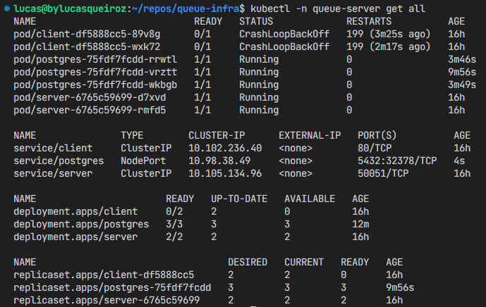

# Queue K8S

This project is part of another repository called [Queue Server](https://github.com/bylucasqueiroz/queue-server "Documentação do Projeto").



## Setup

Make sure you have Minikube configured on your computer, and the image should be built from the other repository.

``` bash
eval $(minikube docker-env)  # Configure the terminal to use Docker with Minikube
docker build -f cmd/server/Dockerfile -t server:latest .
docker build -f cmd/client/Dockerfile -t client:latest .
```

Now you can apply the manifests, run:

``` bash
bash scripts/deploy.sh
```

Access Minikube:

``` bash
minikube service server
minikube service client
```

## Database

kubectl -n queue-server exec -it postgres-665b7554dc-cddgq -- psql -h localhost -U ps_user --password -p 5432 ps_db

Password:
psql (14.10 (Debian 14.10-1.pgdg120+1))
Type "help" for help.
ps_db=#

ps_db=# \conninfo

You are connected to database "ps_db" as user "ps_user" on host "localhost" (address "::1") at port "5432".